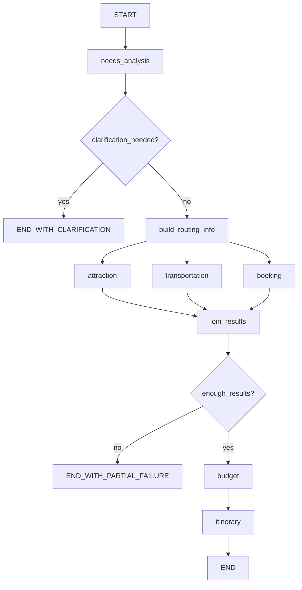

# 旅行规划 Agent 核心设计说明书

## 1. 项目目标

本项目旨在构建一个基于 **LangGraph** 的多 Agent 旅行规划系统。  
系统从用户的一句自然语言需求出发，依次完成：

- 需求解析
- 景点与餐饮推荐
- 跨城交通规划
- 酒店推荐
- 预算分析
- 最终行程整合

第一阶段仅关注 **Agent 核心能力与编排流程**，暂不讨论：

- 用户输入封装
- 前端界面
- CLI 交互
- HTML / PDF 输出形式

---

## 2. 总体设计原则

### 2.1 单一职责

每个 Agent 只负责一个明确领域，避免出现“大而全 Agent”。

### 2.2 状态共享

所有 Agent 通过统一的 `TravelPlanState` 读写信息，避免重复解析和隐式依赖。

### 2.3 工具与业务分离

外部数据访问能力通过独立 client 模块封装，Agent 本身只处理业务判断。

### 2.4 第一版优先稳定

第一阶段先完成稳定主链路：

- 不让 `booking` 依赖 `attraction`
- 不做预算超支后的自动回流重规划
- 不把所有条件都做成复杂图分支

---

## 3. 核心目录结构

```text
travel-planner/
├── state.py
├── workflow.py
├── date_utils.py
├── flyai_client.py
├── weather_client.py
├── transport_clients.py
└── agents/
    ├── needs_analysis.py
    ├── attraction.py
    ├── transportation.py
    ├── booking.py
    ├── budget.py
    └── itinerary.py
```

---

## 4. 文件级职责划分

| 文件 | 职责 |
|---|---|
| `state.py` | 定义全局状态对象及各类结构化结果 |
| `workflow.py` | 定义 LangGraph 工作流、节点关系和条件边 |
| `date_utils.py` | 统一处理日期计算和数据源可用性判断 |
| `flyai_client.py` | 封装景点、餐饮、酒店、机票等旅行数据能力 |
| `weather_client.py` | 封装心知天气的逐日天气预报能力 |
| `transport_clients.py` | 封装 12306 与 FlyAI 数据访问能力 |
| `agents/needs_analysis.py` | 将自然语言需求转成结构化旅行需求 |
| `agents/attraction.py` | 生成景点、餐饮和天气相关建议 |
| `agents/transportation.py` | 生成跨城交通方案 |
| `agents/booking.py` | 生成酒店候选与推荐 |
| `agents/budget.py` | 汇总费用并判断预算情况 |
| `agents/itinerary.py` | 整合全部结果，生成最终每日行程 |

---

## 5. 全局状态设计

### 5.1 顶层 `TravelPlanState`

| 字段 | 说明 |
|---|---|
| `raw_user_input` | 用户原始输入 |
| `requirement` | 结构化后的旅行需求 |
| `routing_info` | 日期与数据源可用性信息 |
| `attraction_result` | 景点 / 餐饮 / 天气结果 |
| `transportation_result` | 交通方案 |
| `booking_result` | 酒店方案 |
| `budget_result` | 预算分析 |
| `itinerary_result` | 最终行程 |
| `errors` | 错误信息 |
| `warnings` | 非致命警告 |
| `current_phase` | 当前执行阶段 |
| `status` | 当前整体状态 |

### 5.2 `TravelRequirement`

| 字段 | 说明 |
|---|---|
| `origin_city` | 出发城市 |
| `destination_city` | 目的地 |
| `start_date` | 出发日期 |
| `end_date` | 结束日期 |
| `days` | 游玩天数 |
| `travelers` | 出行人数 |
| `budget` | 总预算 |
| `preferences` | 兴趣偏好 |
| `transport_preference` | 交通偏好 |
| `hotel_preference` | 酒店偏好 |
| `special_constraints` | 特殊约束 |
| `missing_fields` | 缺失字段 |
| `clarification_needed` | 是否需要继续追问 |
| `normalized_query` | 规范化需求描述 |

### 5.3 `RoutingInfo`

| 字段 | 说明 |
|---|---|
| `days_until_departure` | 距离出发还有多少天 |
| `weather_available` | 是否可查有效天气 |
| `train_query_available` | 是否可查 12306 |
| `flight_query_available` | 是否可查机票 |
| `hotel_query_available` | 是否可查酒店 |
| `transport_mode_strategy` | 交通检索策略 |
| `degraded_mode` | 是否进入降级模式 |
| `degradation_reasons` | 降级原因 |
| `data_freshness_note` | 数据新鲜度说明 |

---

## 6. Agent 设计

### 6.1 `needs_analysis`

**职责**  
将用户自然语言输入解析为标准旅行需求。

**输入**

```json
{
  "raw_user_input": "6月15日从上海去杭州玩3天，两个人预算3000，喜欢西湖和美食"
}
```

**输出**

```json
{
  "requirement": {
    "origin_city": "上海",
    "destination_city": "杭州",
    "start_date": "2026-06-15",
    "end_date": "2026-06-17",
    "days": 3,
    "travelers": 2,
    "budget": 3000,
    "preferences": ["西湖", "美食"],
    "transport_preference": null,
    "hotel_preference": null,
    "special_constraints": [],
    "missing_fields": [],
    "clarification_needed": false
  }
}
```

---

### 6.2 `attraction`

**职责**  
根据目的地与偏好，生成景点、餐饮及天气相关建议。

**输入**

- `requirement`
- `routing_info`

**输出**

- `attractions`
- `restaurants`
- `weather`
- `recommended_attractions`
- `notes`

**设计说明**  
教程项目中的 `AttractionSearchAgent` 与 `WeatherQueryAgent` 可合并参考。

---

### 6.3 `transportation`

**职责**  
生成跨城交通方案，支持高铁 / 飞机 / 混合推荐。

**输入**

- `requirement`
- `routing_info`

**输出**

- `outbound_options`
- `return_options`
- `recommended_plan`
- `alternative_plans`
- `limitations`

**设计说明**  
这是目标项目中的新增核心模块，教程项目中几乎没有可直接复用的对应能力。

---

### 6.4 `booking`

**职责**  
根据城市、时间和住宿偏好生成酒店推荐。

**输入**

- `requirement`
- `routing_info`

**输出**

- `hotels`
- `recommended_hotels`
- `search_strategy`
- `selection_reason`
- `limitations`

**第一版约束**

- 不依赖 `attraction_result`
- 只按城市级范围 + 用户偏好进行检索

---

### 6.5 `budget`

**职责**  
对交通、酒店、门票和餐饮费用进行汇总与判断。

**输入**

- `requirement`
- `attraction_result`
- `transportation_result`
- `booking_result`

**输出**

- `transport_cost`
- `hotel_cost`
- `ticket_cost`
- `meal_cost`
- `total_cost`
- `remaining_budget`
- `is_over_budget`
- `suggestions`

**第一版约束**

第一阶段只做：

- 成本估算
- 超预算判断
- 优化建议

暂不做自动反向重规划。

---

### 6.6 `itinerary`

**职责**  
整合全部上游结果，生成最终每日安排。

**输入**

- `requirement`
- `attraction_result`
- `transportation_result`
- `booking_result`
- `budget_result`

**输出**

- `days`
- `summary`
- `highlights`
- `travel_tips`
- `warnings`

**重要边界**

该 Agent 只负责整合，不重新：

- 搜索景点
- 查询酒店
- 计算预算
- 选择数据源

---

## 7. 支撑模块设计

### 7.1 `date_utils.py`

负责：

- 日期解析
- 出发倒计时
- 天气可用性判断
- 12306 可查窗口判断
- FlyAI 可查窗口判断
- 生成 `routing_info`

### 7.2 `flyai_client.py`

负责：

- 景点查询
- 餐饮查询
- 机票查询
- 酒店查询

### 7.3 `weather_client.py`

负责：

- 天气逐日预报查询
- 统一天气结果格式

### 7.4 `transport_clients.py`

负责：

- 12306 查询
- FlyAI 机票查询
- FlyAI 酒店查询
- 底层返回值统一格式化
- 异常转换与上抛

---

## 8. LangGraph 工作流设计

### 8.1 主流程



### 8.2 节点说明

| 节点 | 说明 |
|---|---|
| `needs_analysis` | 解析原始输入 |
| `clarification_needed?` | 判断是否缺少关键信息 |
| `build_routing_info` | 根据日期计算数据源可用性 |
| `attraction` | 景点与餐饮推荐 |
| `transportation` | 交通规划 |
| `booking` | 酒店推荐 |
| `join_results` | 汇合并行结果 |
| `enough_results?` | 判断是否有足够信息继续 |
| `budget` | 预算汇总 |
| `itinerary` | 最终整合 |

---

## 9. 条件边设计

### 9.1 条件边一：需求是否完整

```text
needs_analysis
  ├─ clarification_needed = true  → END_WITH_CLARIFICATION
  └─ clarification_needed = false → build_routing_info
```

### 9.2 条件边二：结果是否足够继续

```text
join_results
  ├─ enough_results = false → END_WITH_PARTIAL_FAILURE
  └─ enough_results = true  → budget
```

---

## 10. 失败与降级策略

| 节点 | 失败时策略 |
|---|---|
| `needs_analysis` | 终止流程 |
| `attraction` | 允许继续，必要时使用兜底推荐 |
| `transportation` | 允许继续，最终输出时说明限制 |
| `booking` | 允许继续，提示住宿需另行确认 |
| `budget` | 允许继续，但预算说明降级 |
| `itinerary` | 若失败则整体失败 |

---

## 11. 第一阶段实现范围

### 必须完成

- 状态对象
- 六个核心 Agent
- 日期路由
- 三分支并行
- 预算汇总
- 最终行程整合

### 暂不纳入第一阶段

- 酒店基于景点位置推荐
- 超预算后的自动回流重规划
- 人工确认节点
- 复杂前端交互
- 多轮动态修订

---

## 12. 可从教程项目借鉴的部分

| 教程项目内容 | 借鉴方式 |
|---|---|
| 数据模型设计 | 强烈建议借鉴 |
| 景点推荐逻辑 | 可借鉴职责划分，但数据源改为 FlyAI |
| 天气查询逻辑 | 可借鉴使用方式，但数据源改为心知天气 |
| 酒店 Agent 角色 | 可借鉴职责定义 |
| 预算字段设计 | 可借鉴 |
| 最终行程结构 | 可借鉴 |
| 工具层隔离思想 | 强烈建议保留 |
| 顺序式 PlannerAgent | 不建议直接保留 |

---

## 13. 不建议直接照搬的部分

- 单体式 `PlannerAgent`
- 独立天气 Agent
- Web 前后端整体架构
- 依赖表单输入的既有处理方式
- Unsplash 图片增强链路

---

## 14. 推荐开发顺序

1. `state.py`
2. `needs_analysis.py`
3. `date_utils.py`
4. `attraction.py`
5. `transportation.py`
6. `booking.py`
7. `budget.py`
8. `itinerary.py`
9. `workflow.py`

---

## 15. 后续可扩展方向

第二阶段可加入：

- 酒店依赖景点结果
- 预算超支后的自动回流调整
- 更复杂的评分模型
- 人工确认节点
- 连续多轮修改行程
- 更丰富的降级策略

---

## 16. 最终结论

基于现有教程项目进行改造是可行的，但应当采用：

- 业务思想复用
- LangGraph 核心重构
- 新增交通与路由模块
- 拆分 PlannerAgent 职责

的方式推进。

该项目第一阶段最合适的技术路径是：

> 用教程项目帮助理解“旅行规划这个问题该怎么建模”，  
> 再用 LangGraph 重新实现一个更清晰、更可扩展的多 Agent 编排系统。
